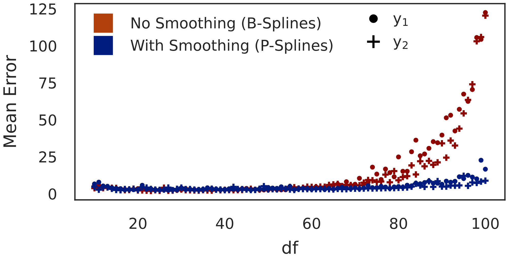

# ICASSP 2027

**"Making Tensor Decoupling More Robust and Less Parametric"**

*Maxime Rochkoulets, Joppe De Jonghe, Mariya Ishteva*



***

All dependencies are in the `pyproject.toml` so you can simply run
```bash
pip install .
python3 -m jupyter notebook main.ipynb
```

The source code to reproduce our plots is in the [main.ipynb](main.ipynb) notebook.

For the decoupling algorithm itself, feel free to take a look at the [decoupling](https://github.com/mrochk/decoupling) package.
